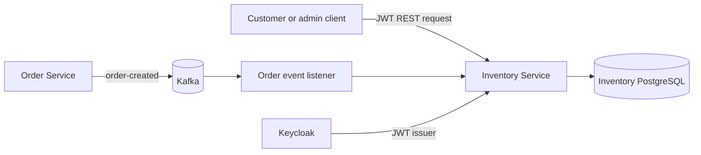
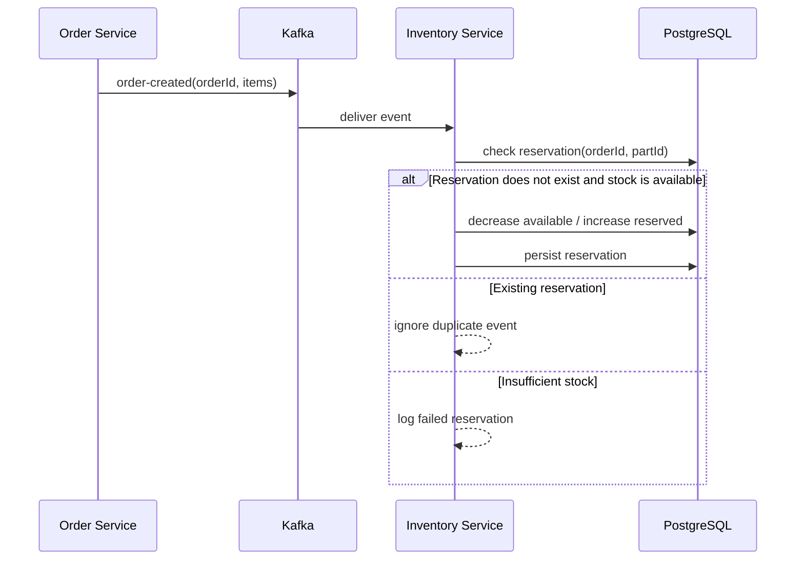
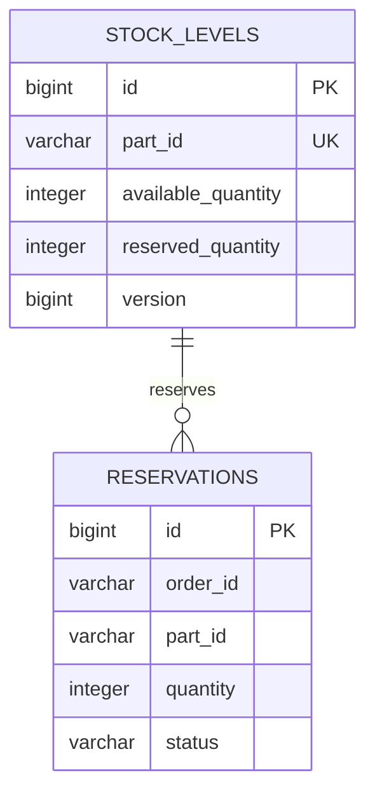

# SpareLink Inventory Service

[](https://github.com/tadiwanashe-mashongwa/inventory-service/actions/workflows/ci.yml)
[](target/site/jacoco/index.html)

The Inventory Service manages spare-part stock for the SpareLink automotive platform. It exposes secured stock operations and consumes order events to reserve stock reliably.

## Capabilities

- Add stock and record breakage deductions.
- Return the available quantity for a part.
- Reserve stock when the Order Service publishes an `order-created` Kafka event.
- Prevent duplicate reservations for the same order and part.
- Persist stock levels and reservations in PostgreSQL with Flyway-managed schema migrations and optimistic locking.
- Enforce Keycloak JWT roles: `CUSTOMER` and `ADMIN`.

## Architecture



## Stock reservation flow



## API and security

| Endpoint | Role | Purpose |
| --- | --- | --- |
| `GET /api/inventory/stock/{partId}` | `CUSTOMER` or `ADMIN` | Get available stock |
| `POST /api/inventory/stock?partId={id}&quantity={n}` | `ADMIN` | Add stock |
| `POST /api/inventory/breakage?partId={id}&quantity={n}` | `ADMIN` | Deduct damaged stock |
| `GET /actuator/health` | Public | Health probe |
| `/swagger-ui/index.html` | Public | Interactive API documentation |
| `/v3/api-docs` | Public | OpenAPI specification |

JWTs are validated against `KEYCLOAK_ISSUER_URI`. The default issuer is `http://localhost:8080/realms/sparelink`.

## Database model



Flyway migration `V1__create_inventory_schema.sql` owns the database schema. Hibernate validates it rather than creating tables.

## Run locally

Start the service and infrastructure with Docker:

```powershell
docker compose up --build
```

The application is exposed at `http://localhost:8082`; PostgreSQL at `localhost:5432`; Kafka at `localhost:9092`.

## Testing and coverage

The test suite covers unit, controller/security, global exception, Spring integration, Flyway, PostgreSQL Testcontainers, and Kafka Testcontainers scenarios.

```powershell
$env:JAVA_HOME = 'C:\Program Files\Java\jdk-17'
.\mvnw.cmd test
```

GitHub Actions runs this suite for every pull request and push to `main`, uploads the JaCoCo report, and refreshes the coverage badge after successful main-branch builds.
